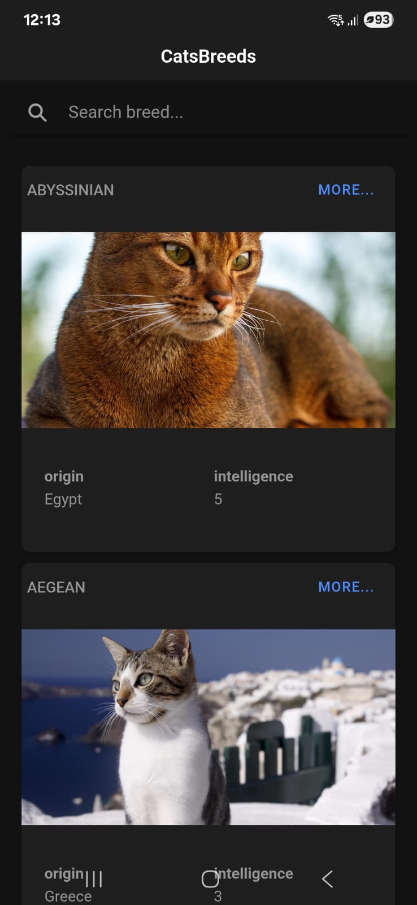

# 🐱 CatBreeds  



Una aplicación Ionic para buscar razas de gatos y mostrar detalles con imágenes dinámicas.

---

## 📝 Descripción

Esta aplicación fue desarrollada como parte de un proyecto para mostrar distintas razas de gatos consumiendo una API pública. Permite al usuario explorar razas con una interfaz amigable, moderna y adaptable.

---

## 🔗 Demo en Vivo

Puedes descargar y probar la APK aquí:  
📦 [Descargar APK desde Google Drive](https://drive.google.com/file/d/1bvHu8EdzV_OznPlFbWM11WjnA-0aqmNd/view?usp=drive_link)

---

## ✨ Características Clave

- 🔍 **Búsqueda dinámica**: Las razas se cargan y muestran automáticamente.
- 💎 **Diseño moderno**: Interfaz limpia usando componentes de Ionic y Angular.
- 📱 **Diseño responsivo**: Funciona perfectamente en móviles y escritorio.
- 🔁 **Scroll infinito**: Carga progresiva de datos para mejor rendimiento.
- ⏳ **Loading Spinner**: Indicadores visuales mientras se cargan los datos.

---

## 🛠️ Tecnologías Usadas

- **Angular 17+**
- **Ionic Framework**
- **RxJS**
- **API TheCatAPI.com**
- **Android studio**
- **Capacitor**

---

## 🧱 Estructura de carpetas

Este proyecto utiliza una **estructura por carpetas técnicas**, un estilo arquitectónico común y práctico en aplicaciones desarrolladas con Ionic + Angular. El código está organizado según el **tipo de responsabilidad**, lo que facilita su mantenimiento en proyectos pequeños y medianos.

**Principales carpetas:**

- `components/` – Componentes reutilizables de la interfaz  
- `constants/` – Constantes globales de la aplicación  
- `interface/` – Interfaces y modelos de datos en TypeScript  
- `pages/` – Vistas y pantallas principales de la app  
- `pipes/` – Pipes personalizados para transformación de datos  
- `services/` – Lógica de negocio e integración con APIs

> 📝 A medida que el proyecto crece, esta estructura permite una transición gradual hacia una arquitectura modular o limpia sin perder claridad ni mantenibilidad.

---

## 🧪 Testing
Testeé el servicio catsBreeds: Se crearon pruebas unitarias usando Jasmine/Karma
para verificar que las peticiones HTTP al API de razas de gatos (catsBreeds) retornaran los datos correctamente

```bash

# Ejeucta el Test Runner
ng test

```

---
## 📋 Requisitos Cumplidos

✅ Integración con API pública  
✅ Framework moderno (Angular + Ionic)  
✅ UI limpia y adaptable  
✅ Scroll infinito y carga progresiva
✅ Barra de busqueda
✅ Organización clara del código

---

## 🚀 Instalación y Ejecución

### 🔧 Requisitos

- Node v20.16.0
- ionic Framework
- Angular: 19.2.14
- Android Studio

### 🧩 Instalación

```bash
# Clona el repositorio
git clone https://github.com/imartinezaguas/CatBreedsPragma.git

# Entra en la carpeta del proyecto
cd CatBreeds

# Instala las dependencias
npm install
```

### ▶️ Modo Desarrollo

```bash
ionic serve
```

Accede a `http://localhost:8100/` en tu navegador.

### 🏗️ Build de Producción

```bash
ionic build
```

---

## 👨‍💻 Autor

Iván Martinez aguas

---

## 📄 Licencia

Este proyecto está licenciado bajo **MIT**. Revisa el archivo `LICENSE.md` para más detalles.
